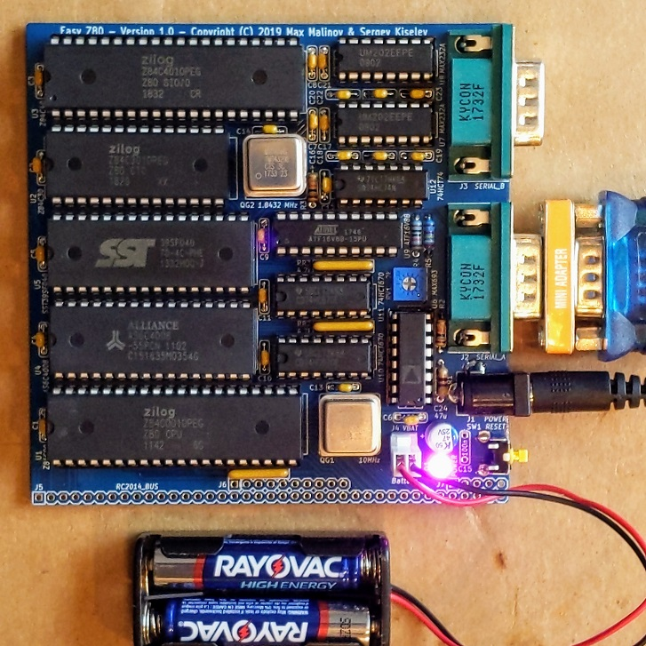

# Easy Z80
An easy to build Zilog Z80 based single board computer

## Table of Content
* [Introduction](#introduction)
* [Specifications](#specifications)
* [Hardware Documentation](#hardware-documentation)
  * [Schematic and PCB Layout](#schematic-and-pcb-layout)
  * [Connectors and Jumpers](#connectors-and-jumpers)
  * [Bill of Materials](#bill-of-materials)
* [Firmware Documentation](#firmware-documentation)
  * [BIOS and OS](#bios-and-os)
  * [SPLD Fuse Map](#spld-fuse-map)
* [Release Notes](#release-notes)
  * [Changes](#changes)
  * [Known Issues](#known-issues)
  * [Wishlist](#wishlist)

## Introduction
My son Max asked me what does it take to build a computer, and whether he can design and build one himself. This project is our attempt to design and build a simple, easy to understand, yet capable single board computer.
It reuses the same memory paging mechanism I've implemented in Zeta SBC V2. It uses Zilog Z80 SIO/O and Z80 CTC peripheral ICs and implements daisy chain mode 2 interrupt configuration.

## Specifications
* Processor: Zilog Z80 CPU (CMOS version - Z84C00)
* Memory: 512 KiB battery-backed SRAM, 512 KiB Flash ROM
* I/O:
  * Zilog Z80 CTC - Programmable timer used for periodic interrupts and (optionally) for generating UART clock
  * Zilog Z80 SIO - Dual channel serial interface, used for console and for connecting to other peripheral devices
* Bus: [RC2014](https://rc2014.co.uk/) compatible
* Microprocessor Supervisor:
  * Reset generation
  * SRAM battery backup
  * Power failure NMI
  * Watchdog (optional)

## Hardware Documentation

For the version 1.0 schematic, PCB layout, and bill of materials please refer to [tag v1.0](https://github.com/skiselev/easy_z80/tree/v1.0)

### Schematic and PCB Layout

[Schematic - Version 1.1](KiCad/Easy_Z80-Schematic-1.1.pdf)

[PCB Layout - Version 1.1](KiCad/Easy_Z80-Board-1.1.pdf)

### Connectors and Jumpers

#### J1 - Power
Connect regulated +5V power supply to this connector.

Pin                     | Signal Name | Description
----------------------- | ----------- | -----------
Tip (the inner contact)	| VCC         | Positive terminal - +5V
Barrel / sleeve	        | GND         | Negative terminal - ground

#### J2, J3 - Serial Channel A and Serial Channel B
Pin    | Signal Name | Description
------ | ----------- | -----------
1	     | DCD         |	Carrier Detect; Not used - Not connected on the SBC
2	     | RXA, RXB    |	Receive Data; Input to SBC
3	     | TXA, TXB    |	Transmit Data; Output from SBC
4	     | DTR         |	Data Terminal Ready; Not used - Not connected on the SBC
5	     | GND         |	Connected to the SBC GND signal
6	     | DSR         | Data Set Ready; Not used - Not connected on the SBC
7      |	RTSA, RTSB  | Request to Send; Output from SBC
8	     | CTSA, CTSB  | Clear to Send; Input to SBC
9	     | RI	         | Ring Indicator; Not used - Not connected on the SBC
Shield	| DE9 Shield	 | Connected to the SBC GND signal

#### J4 - NVRAM Battery
Connect 3V battery for SRAM backup to this connector.

**Important: If the SRAM battery backup is not desired, short J4 with a jumper. Do not leave this connector open.**

Pin | Signal Name | Description
--- | ----------- | -----------
1  	| VBAT        | Positive terminal - +3V
2   | GND         | Negative terminal - ground

#### J5, J6, J7 - RC2014 Bus
Pin   | Signal Name | Description         | Pin  | Signal Name | Description
----- | ----------- | ------------------- | ---- | ----------- | -----------
J5-1  | A15         | Address A15; Output |      |             |
J5-2  | A14         | Address A14; Output |      |             |
J5-3  | A13         | Address A13; Output |      |             |
J5-4  | A12         | Address A12; Output |      |             |
J5-5  | A11         | Address A11; Output |      |             |
J5-6  | A10         | Address A10; Output |      |             |
J5-7  | A9          | Address A9; Output  |      |             |
J5-8  | A8          | Address A8; Output  |      |             |
J5-9  | A7          | Address A7; Output  |      |             |
J5-10 | A6          | Address A6; Output  |      |             |
J5-11 | A5          | Address A5; Output  |      |             |
J5-12 | A4          | Address A4; Output  |      |             |
J5-13 | A3          | Address A3; Output  |      |             |
J5-14 | A2          | Address A2; Output  |      |             |
J5-15 | A1          | Address A1; Output  |      |             |
J5-16 | A0          | Address A0; Output  |      |             |
J5-17 | GND         | Ground              | J6-1 | GND         | Ground
J5-18 | VCC         | Power Supply - +5V  | J6-2 | VCC         | Power Supply - +5V
J5-19 | /M1         | Machine Cycle One; Output | J6-3| /RFSH | DRAM refresh; Output
J5-20 | /RESET      | Reset; Output       | J6-4 | N/C         | Not connected
J5-21 | CPU_CLK     | CPU Clock; Output   | J6-5 | UART_CLK    | UART Clock (1.8432 MHz); Output
J5-22 | /INT        | Interrupt; Input    | J6-6 | /BUSACK     | DMA Bus Acknowledge; Output
J5-23 | /MREQ       | Memory Request; Output | J6-7 | /HALT    | Halt; Output
J5-24 | /WR         | Write Request; Output | J6-8 | /BUSREQ   | DMA Bus Request; Input
J5-25 | /RD         | Read Request; Output | J6-9 | /WAIT      | Wait; Input
J5-26 | /IORQ       | Input/Output Request; Output | J6-10 | /NMI | Non-maskable Interrupt; Input
J5-27 | D0          | Data D0; Input/Output |    |             |
J5-28 | D1          | Data D1; Input/Output |    |             |
J5-29 | D2          | Data D2; Input/Output |    |             |
J5-30 | D3          | Data D3; Input/Output |    |             |
J5-31 | D4          | Data D4; Input/Output |    |             |
J5-32 | D5          | Data D5; Input/Output |    |             |
J5-33 | D6          | Data D6; Input/Output |    |             |
J5-34 | D7          | Data D7; Input/Output |    |             |
J5-35 | TXDA        | Channel A, Transmit Data; Output | J7-1 | TXDB | Channel B, Transmit Data; Output
J5-36 | RXDA        | Channel A, Receive Data; Input   | J7-2 | RXDB | Channel B, Receive Data; Input
J5-37 | USR1        | User Pin 1, Not connected | J7-3 | USR5  | User Pin 5, Not connected 
J5-38 | IEI         | Interrupt Enable Input  | J7-4 | USR6    | User Pin 6, Not connected 
J5-39 | IEO         | Interrupt Enable Output | J7-5 | USR7    | User Pin 7, Not connected 

#### JP1 - Serial Channel A Clock Select
Position        | Description
--------------- | -----------
*1-2 (default)* | 1.8432 MHz (115200 bps if using x16 mode)
2-3             | Programmable using CTC channel 0

#### JP2 - Serial Channel B Clock Select
Position        | Description
--------------- | -----------
*1-2 (default)* | 1.8432 MHz (115200 bps if using x16 mode)
2-3             | Programmable using CTC channel 1

### Bill of Materials

#### Version 1.1

[Easy Z80 project on Mouser.com](https://www.mouser.com/ProjectManager/ProjectDetail.aspx?AccessID=f16751cb33) - View and order all components except of the PCB.

[Easy Z80 project on OSH Park](https://oshpark.com/shared_projects/Rt7SBcRg) - View and order the PCB.

Component type     | Reference | Description                                 | Quantity | Possible sources and notes 
------------------ | --------- | ------------------------------------------- | -------- | --------------------------
PCB                |           | Easy Z80 PCB - Version 1.1                  | 1        | Refer to the [RetroBrew Computers Board Inventory](https://www.retrobrewcomputers.org/doku.php?id=boardinventory#minimal_8085_z80_single_board_computer) page for ordering information, or order from a PCB manufacturer of your choice using provided Gerber or KiCad files
Integrated Circuit | U1        | Z80 CPU, CMOS, 40 pin DIP - Z84C00xxPEG     | 1        | Mouser [692-Z84C0010PEG](https://www.mouser.com/ProductDetail/692-Z84C0010PEG)
Integrated Circuit | U2        | Z80 CTC, CMOS, 28 pin DIP - Z84C30xxPEG     | 1        | Mouser [692-Z84C3010PEG](https://www.mouser.com/ProductDetail/692-Z84C3010PEG)
Integrated Circuit | U3        | Z80 SIO/0, CMOS, 40 pin DIP - Z84C40xxPEG   | 1        | Mouser [692-Z84C4010PEG](https://www.mouser.com/ProductDetail/692-Z84C4010PEG)
Integrated Circuit | U4        | 512 KiB SRAM, 32 pin DIP - AS6C4008         | 1        | Mouser [913-AS6C4008-55PCN](https://www.mouser.com/ProductDetail/913-AS6C4008-55PCN)
Integrated Circuit | U5        | 512 KiB Flash ROM, 32 pin DIP - SST39SF040  | 1        | Mouser [804-39SF0407CPHE](https://www.mouser.com/ProductDetail/804-39SF0407CPHE)
Integrated Circuit | U6        | Microprocessor Supervisory Circuit - MAX693 | 1        | Mouser [584-ADM693ANZ](https://www.mouser.com/ProductDetail/584-ADM693ANZ); Possible alternatives: MAX693, LTC693, ADM691, MAX691, LTC691, ADM695, MAX695, LTC965, LTC1235
Integrated Circuit | U7, U8    | Dual RS-232 Driver/Receiver - MAX232A       | 2        | Mouser [595-TRS232IN](https://www.mouser.com/ProductDetail/595-TRS232IN)
Integrated Circuit | U9        | Simple Programmable Logic Device - ATF16V8B | 1        | Mouser [556-AF16V8B15PU](https://www.mouser.com/ProductDetail/556-AF16V8B15PU)
Integrated Circuit | U10, U11  | 4-by-4 Register File - 74HC670              | 2        | Mouser [595-CD74HC670E](https://www.mouser.com/ProductDetail/595-CD74HC670E)
Integrated Circuit | U12       | Dual Flip Flop - 74HC74                     | 1        | Mouser [595-SN74HC74N](https://www.mouser.com/ProductDetail/595-SN74HC74N)
Oscillator         | QG1       | 10 MHz, CMOS oscillator, Half Can           | 1        | Mouser [774-MXO45HS-3C-10.0](https://www.mouser.com/ProductDetail/774-MXO45HS-3C-10.0)
Oscillator         | QG2       | 1.8432 MHz, CMOS oscillator, Half Can       | 1        | Mouser [774-MXO45HS-3C-1.8](https://www.mouser.com/ProductDetail/774-MXO45HS-3C-1.8)
LED                | D1        | 3 mm, green LED indicator                   | 1        | Mouser [859-LTL-4231N](https://www.mouser.com/ProductDetail/859-LTL-4231N)
Tactile Button     | SW1       | 6 mm tactile button, right angle            | 1        | Mouser [653-B3F-3152](https://www.mouser.com/ProductDetail/653-B3F-3152)
Connector          | J1        | DC Power Jack, 2mm                          | 1        | Mouser [806-KLDX-0202-A](https://www.mouser.com/ProductDetail/806-KLDX-0202-A)
Connector          | J2, J3    | Sub-D DE9M, Right Angle, PCB mount          | 2        | Mouser [806-K22X-E9P-N-99](https://www.mouser.com/ProductDetail/806-K22X-E9P-N-99)
Connector          | J4        | 2 Pin Header with Friction Lock             | 1        | Mouser [571-6404562](https://www.mouser.com/ProductDetail/571-6404562)
Pin Header         | J5 - J7   | 40x2 Pin Header, 2.54 mm Pitch, Right Angle | 1        | Mouser [571-9-103326-0](https://www.mouser.com/ProductDetail/571-9-103326-0)
Capacitor          | C1 - C14, C16 - C23  | 0.1 uF, MLCC, 5 mm Pitch         | 22       | Mouser [594-K104K15X7RF53H5](https://www.mouser.com/ProductDetail/594-K104K15X7RF53H5)
Capacitor          | C24       | 47 uF, 25V, Aluminum Organic Polymer        | 1        | Mouser [80-A750EK476M1EAAE40](https://www.mouser.com/ProductDetail/80-A750EK476M1EAAE40)
Resistor Array     | RN1 - RN3 | 4.7 k, bussed, 5 pin SIP                    | 3        | Mouser [652-4605X-AP1-472LF](https://www.mouser.com/ProductDetail/652-4605X-AP1-472LF)
Resistor Array     | RN4       | 4.7 k, bussed, 9 pin SIP                    | 1        | Mouser [652-4609X-AP1-472LF](https://www.mouser.com/ProductDetail/652-4609X-AP1-472LF)
Resistor           | R1        | 470 ohm, axial                              | 1        | Mouser [603-MFR-25FBF52-470R](https://www.mouser.com/ProductDetail/603-MFR-25FBF52-470R) 
Resistor           | R2 - R4   | 10 kohm, 1% tolerance, axial                | 3        | Mouser [603-MFR-25FRF5210K](https://www.mouser.com/ProductDetail/603-MFR-25FRF5210K)
Resistor           | R5        | 29.4 kohm, 1% tolerance, axial              | 1        | Mouser [603-MFR-25FBF52-29K4](https://www.mouser.com/ProductDetail/603-MFR-25FBF52-29K4)
Trimmer Resistor   | RV1       | 2 kohm, through hole                        | 1        | Mouser [652-3362P-1-202LF](https://www.mouser.com/ProductDetail/652-3362P-1-202LF)
IC Socket          | U1, U3    | 40 pin DIP                                  | 2        | Mouser [517-4840-6000-CP](https://www.mouser.com/ProductDetail/517-4840-6000-CP)
IC Socket          | U4, U5    | 32 pin DIP                                  | 2        | Mouser [517-4832-6000-CP](https://www.mouser.com/ProductDetail/517-4832-6000-CP)
IC Socket          | U2        | 28 pin DIP                                  | 1        | Mouser [517-4828-6000-CP](https://www.mouser.com/ProductDetail/517-4828-6000-CP)
IC Socket          | U9        | 20 pin DIP                                  | 1        | Mouser [517-4820-3000-CP](https://www.mouser.com/ProductDetail/517-4820-3000-CP)
IC Socket          | U6 - U8, U10, U11 | 16 pin DIP                          | 5        | Mouser [517-4816-3000-CP](https://www.mouser.com/ProductDetail/517-4816-3000-CP)
IC Socket          | U12       | 14 pin DIP                                  | 1        | Mouser [517-4814-3000-CP](https://www.mouser.com/ProductDetail/517-4814-3000-CP)
Oscillator Socket  | QG1, QG2  | 4 pin DIP, Half Can                         | 2        | Mouser [535-1108800](https://www.mouser.com/ProductDetail/535-1108800)

## Firmware Documentation

### BIOS and OS

Easy Z80 is supported by [RomWBW](https://github.com/wwarthen/RomWBW) [v2.9.1](https://github.com/wwarthen/RomWBW/releases/tag/v2.9.1) and later. RomWBW includes BIOS, CP/M-80 2.2, Z-System, and a collection of utilities. It also should be possible to run [FUZIX](https://github.com/EtchedPixels/FUZIX) on this board.

### SPLD Fuse Map

Easy Z80 uses an ATF16V8/GAL16V8 SPLD (U9) for address decode logic. The [SPLD fuse map](SPLD/easy_z80_no_wdog.jed) and the [SPLD source code](SPLD/easy_z80_no_wdog.pld) are provided in [SPLD](SPLD) directory of this repository.

## Release Notes

### Changes
* Version 1.1
  * Add pull-up resistors on the data bus (RN4 - 4.7k) to support Z80 interrupt mode 0
  * Use 74HC series instead of 74HCT
  * Remove C15
  * Use RN reference for resistor arrays instead of RR
  * Update silkscreen:
    * Make RN1 reference and value visible
    * Update silkscreen of headers footprints, so that JP1 and JP2 don't cover the traces
    * Add project URL to the bottom silkscreen
* Version 1.0
  * Initial version

### Known Issues
* Version 1.0
  * Top silkscreen: RR1 reference and value are not visible. It should read "RR1, 4.7k"
  * Bottom silkscreen on JP1 and JP2 covers the trace connections, so they are not easily visible
  * Bottom silkscreen: No project URL. Should be [github.com/skiselev/easy_z80](https://github.com/skiselev/easy_z80)
  * Board will not reset when C15 is populated. Workaround: Do not populate this capacitor
  * Schematic and top silkscreen: Use 74HC series instead of 74HCT
  
### Wishlist
* Version 1.0
  * Add pull-ups on the data bus to support extension boards that were not designed for Z80 interrupt mode 2
